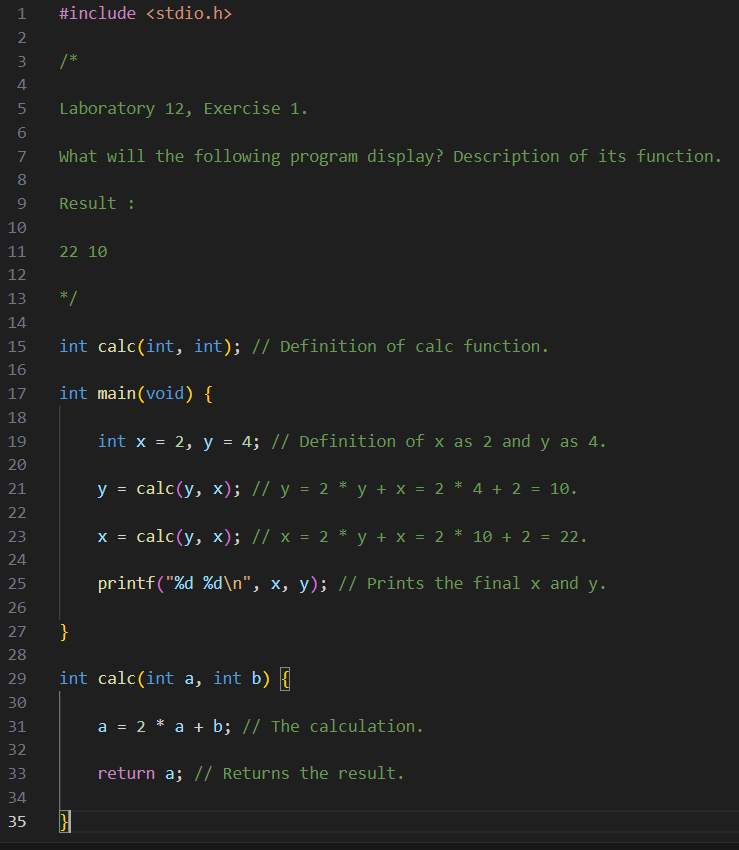

# Laboratory's Exercises 💻

_Basically, this a project which I include all the programs I'm required to code in Univesity ICSD (And not only...)._

#### Platform : 

#### Code Editors : 

#### Programming Languages :

## Screenshots

## License

